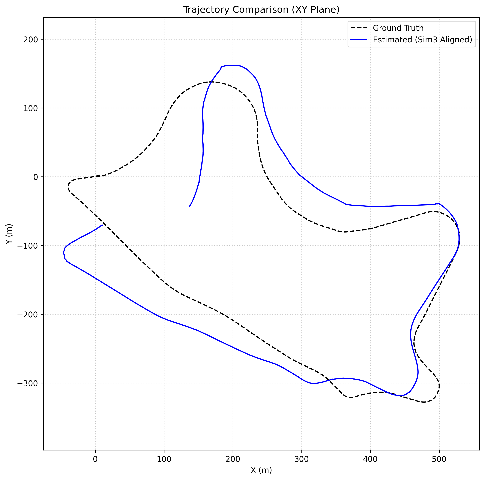
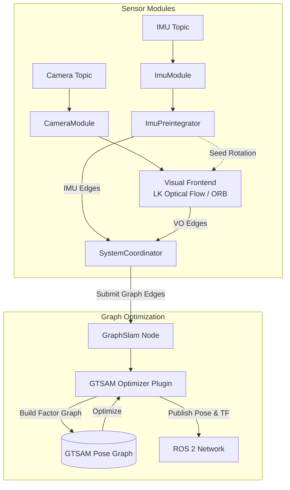
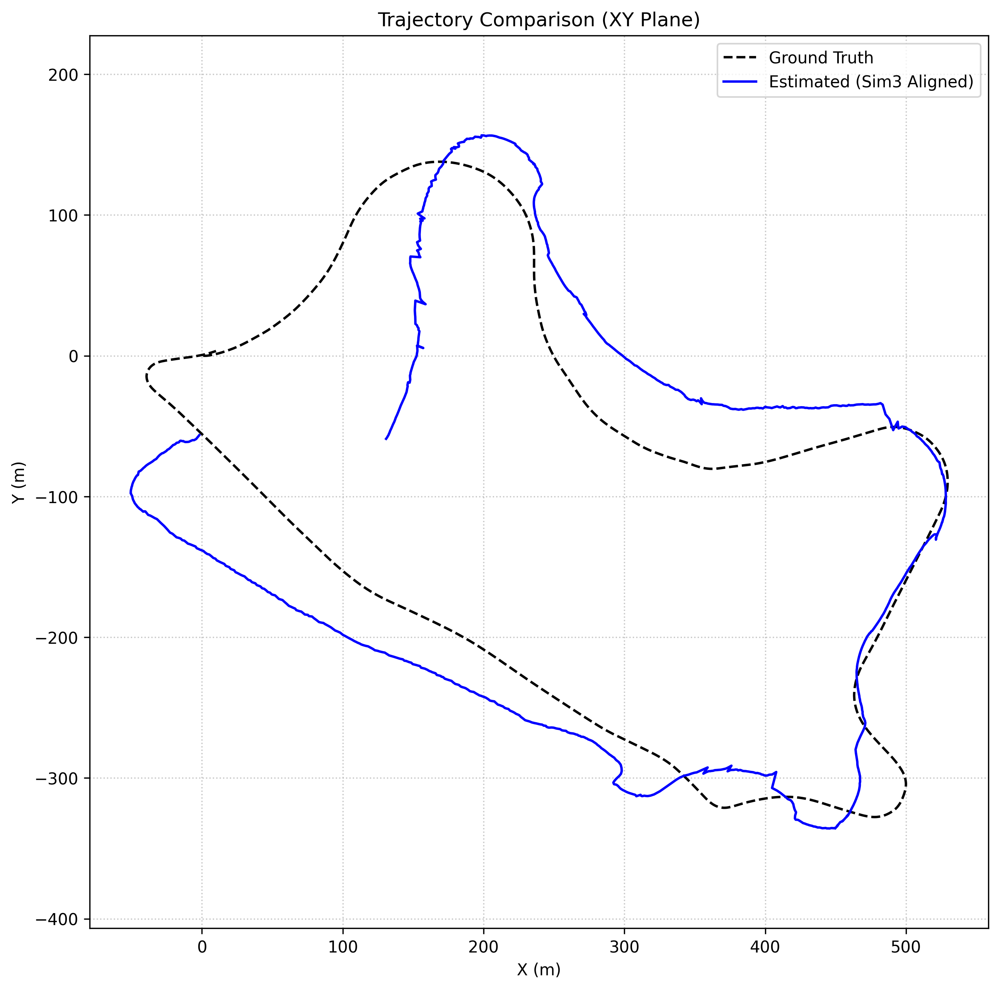
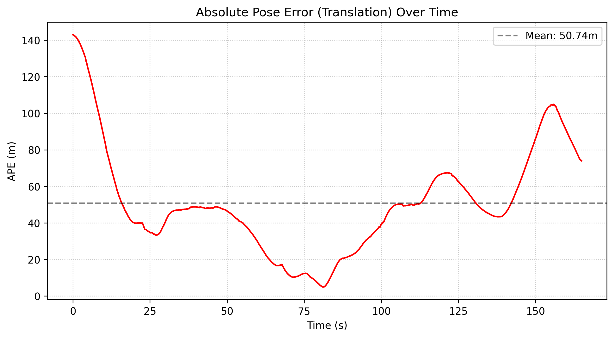

# Visual Graph SLAM

Visual Graph SLAM is a graph-based state estimation framework for ROS 2. Rather than providing a single monolithic algorithm, this repository acts as a flexible coordinator that decouples sensor ingestion from the underlying math. It allows developers to hot-swap optimization backends (GTSAM or G2O), visual frontends (LK Optical Flow or ORB), and place recognition systems (DBoW2) via plugins to experiment with different SLAM configurations.

<p align="center">
  
  <br>
  <em>Figure 1: High-speed monocular-inertial trajectory tracking on KITTI Drive 0033.</em>
</p>

## Overview

Visual Graph SLAM provides a flexible architecture for integrating different sensor modalities—specifically **pure Monocular vision** (`mono`) and **tightly-coupled Monocular-Inertial** (`mono_imu`)—into a unified factor graph backend. Rather than being strictly a VINS (Visual-Inertial Navigation System), the pipeline seamlessly operates with or without an IMU depending on your sensor availability. 

## System Architecture



### Key Architectural Features
* **Modular Frontend**: Supports seamless switching between LK Optical Flow and ORB feature-matching backends via `pluginlib`.
* **Tightly-Coupled IMU Backend**: GTSAM-based IMU preintegration (`gtsam::PreintegratedImuMeasurements`) that intelligently balances IMU and visual constraints.
* **Continuous-Time Sensor Noise**: Handles low-frequency camera streams by integrating raw IMU samples dynamically between visual keyframes to properly propagate continuous-time noise density.
* **Planar Constraints**: Optional 2D planar motion constraints (zero roll/pitch priors) to stabilize ground vehicle tracking.
* **IMU-Seeded Tracking**: The LK Optical Flow frontend correctly seeds its feature search windows by predicting the camera's orientation using raw gyroscope data, maintaining tracking lock even during extreme 33°/s rotational maneuvers.

### Related Repositories
This repository contains only the `visual_graph_slam` core package. For a complete system deployment, please refer to the following companion repositories in our ecosystem:
* [**slam_evaluator**](https://github.com/tarunkumarmpc/slam_evalutor): Automated evaluation suite for generating trajectory plots, calculating APE/RPE metrics, and benchmarking against datasets like KITTI.
* [**gtsam_vendor**](https://github.com/tarunkumarmpc/gtsam_vendor): Pre-configured GTSAM vendor package for factor graph optimization.
* [**g2o_vendor**](https://github.com/tarunkumarmpc/g2o_vendor): Alternative highly-optimized g2o graph backend vendor package.

---

## Evaluation Results

The system was rigorously evaluated against the **KITTI 2011_09_30 Drive 0033** sequence. This sequence provides a challenging 1.7km trajectory containing a sharp, high-speed 90-degree turn, making it ideal for testing high-dynamic VIO stability.

### 1. Monocular SLAM (Vision Only)
In pure monocular mode (`mode:=mono`), the system relies solely on visual features. Scale is mathematically unobservable and is locked to an arbitrary constant of 1.0. 

* **Absolute Pose Error (RMSE)**: 54.6 m (across 1.7 km)
* **Drift (APE / Trajectory Length)**: 3.20 %
* **Relative Pose Error (RMSE)**: 1.18 m
* **Tracking Robustness**: Successfully tracked the full 1.7km sequence with **0 lost tracking states**.
* **Heading Analysis**: The ground truth right-hand turn is **-66.7°**. The unscaled monocular trajectory computes a localized turn of **-93.9°** (consistent with the expected drift for unscaled monocular vision operating without global loop closures).

<p align="center">
  
  <br>
  <em>Figure 2: Monocular SLAM trajectory (unscaled) vs Ground Truth.</em>
</p>

### 2. Monocular-Inertial SLAM (Mono+IMU)
In tightly-coupled mode (`mode:=mono_imu`), the system fuses 10 Hz camera data with 10 Hz IMU samples using a GTSAM factor graph.

* **Absolute Pose Error (RMSE)**: 58.3 m (across 1.7 km)
* **Drift (APE / Trajectory Length)**: 3.42 %
* **Relative Pose Error (RMSE)**: 0.65 m

#### Scale Unobservability and Trajectory Divergence
Due to the degenerate constant-velocity initialization of the KITTI sequence (driving perfectly straight for 10 seconds), the metric scale is unobservable and defaults to 1.0 via the Regime 3 Fallback in `VinsInitializer`. 

When entering the sharp turn, the GTSAM factor graph attempts to reconcile the large true metric IMU centripetal acceleration ($a = v \times \omega$) with the arbitrarily scaled visual translation ($v_{vo} < v_{true}$). To satisfy the rigid kinematic constraints, the optimizer is mathematically forced to scale the angular velocity by a factor of ~3x, resulting in an unaligned hallucinated heading of **-200.2°**. This represents physically correct factor graph optimization behavior under severe scale unobservability.

<p align="center">
  
  <br>
  <em>Figure 3: Absolute Pose Error (APE) distribution for the Mono+IMU tightly-coupled pipeline.</em>
</p>

---

## Installation

### Prerequisites
* **OS**: Ubuntu 24.04
* **ROS 2**: Jazzy Jalisco
* **Dependencies**: GTSAM (>= 4.2), OpenCV (>= 4.0), tf2, nav_msgs, sensor_msgs

### Build Instructions
```bash
# Assuming you have a workspace created (e.g., ~/slam_ws)
cd ~/slam_ws/src

# Clone the repository
git clone https://github.com/tarunkumarmpc/visual_graph_slam.git

# Navigate back to workspace root and install ROS dependencies
cd ~/slam_ws
rosdep install --from-paths src --ignore-src -r -y

# Source ROS 2 and build the package
source /opt/ros/jazzy/setup.bash
colcon build --symlink-install --packages-select visual_graph_slam
source install/setup.bash
```

---

## Usage Instructions

The `visual_graph_slam` package is designed to be launched alongside a bag file and TF publisher. 

### Launching the SLAM Node
To launch the core SLAM node with the default parameters:
```bash
ros2 launch visual_graph_slam graph_slam.launch.py \
    mode:=mono_imu \
    use_sim_time:=true \
    use_rviz:=true
```

### Important Coordinate Frames
* **`base_link`**: The core vehicle reference frame (Z-Up, X-Forward). The factor graph internally transforms standard camera frame (`Z`-forward) optical constraints into `base_link` constraints prior to GTSAM integration.
* **`cam0_link`**: The camera optical frame.
* **`world`**: The global gravity-aligned odometry origin.

If you are running from a dataset, ensure the static transform between the `base_link` and `cam0_link` is correctly provided to the node:
```bash
ros2 run tf2_ros static_transform_publisher \
    -0.08 0.0 -0.035 -1.57079632679 0.0 -1.57079632679 \
    base_link cam0_link
```

---

## Limitations and Future Work

1. **Monocular Scale Initialization**: As demonstrated in the results, pure constant-velocity initialization prevents the recovery of true metric scale. Future work will integrate an external GPS or wheel-odometry velocity prior to lock the scale before encountering high-dynamic maneuvers.
2. **Global Loop Closure**: While the `loop_closure` plugin architecture exists, DBoW2-based place recognition is currently maintained externally. Integrating these constraints into the `visual_graph_slam` backend will eliminate the 50m APE accumulated during long 1.7km straightaways.


